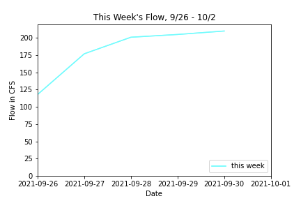
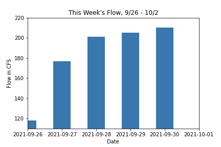
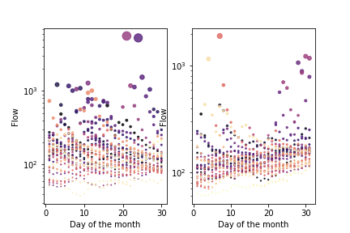
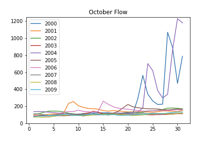
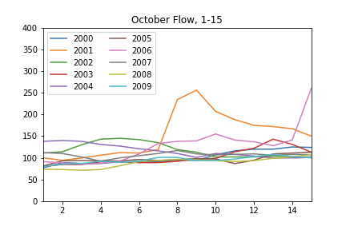

# Gigi Giralte
**10/4/21** \
**Assignment 6**

____
## Grade
3/3: Great work! I love your plotting figure 3 is really cool. 
___

For 10/3-10/9, I predicted that the flow would be 160 because the flow for this past week got up to the 200s and since Camp Verde isn't expecting much rain (if any rain), I think the flow will drop down. For the week of 10/10-10/16, I predicted that the flow would be 115 because again, Camp Verde shouldn't be getting much rain so I believe that the flow will decrease. Also, based on my analysis of previous years, I think the flow will start to decrease overall as we move into the first couple weeks of October. 

### Graph 1:

For my first graph, I made a line graph by using ax.plot and looking at the flow data. This graph allowed me to see the trend of the flow for this past week, 9/26-10/2, helping me determine and predict how the flow will change for this next week.

### Graph 2:

This is a bar graph of the flow for this past week as well. I made this graph by using ax.bar and then ax.set to get the range of dates that I wanted. This again helps to determine the flow for this week and helps me predict the flow for the coming week.

### Graph 3:

This scatter plot shows the flows for the months of September and October. The individual dots (colors) represent the different years since 1990 and the size of the dots represents the amount of flow. This shows that, near the end of the September, there was a trend where the flow started to taper down. However, in October, there are some larger outliers which shows that it's possible that there could be some larger variations in flow as we move into October.

### Graph 4:

This line graph shows the flows for October from 2000 to 2010. The x-axis displays the day of the week so you can easily see how the flow has fluctuated over the years and over the month. I made this graph by using ax.plot and by using a for loop to pick out just the month of October from 2000-2010. This helps me see how the flow varies throughout the month of October, aiding me in my prediction for this next week.

### Graph 5:

This other line graph zooms in on the flows for October from 2000 to 2010 for the first half of the month. I did this by changing the xlim and shrinking the ylim a little bit so it's easier to see the variations in the lines. Since we are moving into the beginning of October, I wanted to see what the trends have been for the beginning of the month over the years.

### Graph 6:

This scatter plot shows the flow for the week of 10/3-10/9 in 2019 and 2018 respectively. I made this graph with ax.scatter and made sure to make two of them so it was easy to compare side by side (using plt.subplots(1,2)). This allows me to see what the trend was for this next week that we are forecasting. It gives me a better idea about what the flow was in previous years and from there I can approximate what it'll be for this next week.
