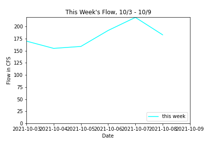
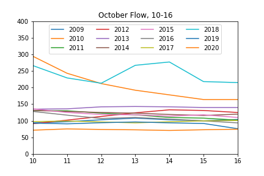
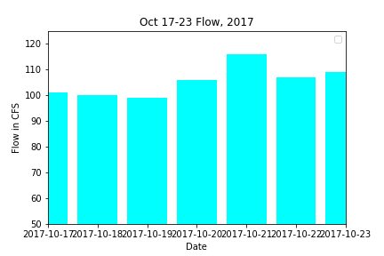

# Gigi Giralte
**10/11/21** \
**Assignment 7**

## Final Answers
Week 1 Forecast (10/10-10/16): 159 CFS \
Week 2 Forecast (10/17-10/23): 179 CFS \
Plot 1: \
Plot 2: \
Plot 3: \

Printed Information: [enter below]

## Code Review:
Is the script easy to read and understand? (Are variables and functions named descriptively when useful? Are the comments helpful? Can you run the script on your own easily? Are the doc-strings useful?)

I found the script generally easy to read and run. The notes were very helpful in demonstrating what the many different lines of code were for. I was a bit confused regarding the week 1 forecast function. It states that the prediction it creates is a random number between the min and max, however, I ran the cell multiple times and received the same result each time. However, when I ran the script everything ran as intended without any issue.

Does the code follow PEP8 style consistently? (If not are there specific instances where the script diverges from this style?)

The only issues linter picked up in the pep8 style were in the formatting of the object names and issues with the "print" format. Neither of which seem major.

Is the code written succinctly and efficiently? (Are there superfluous code sections? Is the use of functions appropriate? Is the code written elegantly without decreasing readability?)

The code is written very efficiently and I cannot find any areas where I could re-write it to be more succinct. As I stated before, I noticed that the week 1 forecast's choosing of a random number between min and max values wasn't working. Every time I ran it I got the same value, which according to the description of your function, I shouldn't have.
