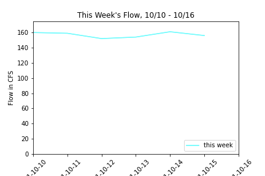

# Gigi Giralte
**10/18/21** \
**Assignment 8**

### How I Generated my Forecasts:
For my first forecast, I took the average of the past week's flow to determine what my forecasted flow would be for this week (157cfs). For my 2 week forecast, I used timeseries. I first averaged the flow in all of the days in October from 1990-2020 and then I added the standard deviations of these past three weeks together to get the forecasted flow for this week (146cfs). When I tried just doing the mean or the average of October 24-30, I got a really high value and so I decided to piece together a flow by doing the standard deviation of the past 3 weeks.

### Graphs:
Graph 1:\

Graph 2:\

Graph 3:\

### Peer Evaluation Reflection:
I didn't really receive any good suggestions for specific parts of my code. However, I did work on trying to make it clearer with more comments to explain more of what I'm doing.

### Timeseries:
I used timeseries in the same way that we did during our practice during class where we took the mean for all of the days in October from 1990-2020.

### Script I'm Proud Of:
I really like my second plot. I'm proud of the code, specifically with the index actually, and I like how I "zoomed in" on this week's days. I also think the plot turns out really good and I enjoy how clean it looks with the location of the legend.
